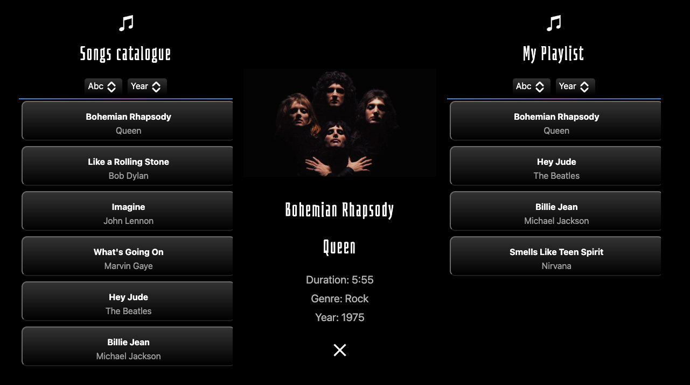

# Playlist application

To run use: 
``docker-compose up`` in awesome-playlist root directory and connect to: `http://localhost:3000`

### Frontend:
React, Typescript, Bootstrap

### Backend: 
Kotlin, SpringBoot, SpringData, Hibernate

### Database: 
MySQL

---
#### TODO:
- ids are longs (consider using value objects or UUID)
- credentials exposed (use tool like AWS ParamStore)
- album covers are random — add more 
- error handling (business exceptions)
- logging
- time added the song!
- only one user and one playlist at the moment 
- authentication
- implement filtering
- security
- add some covers - mention its random
- no domain, just CRUD so no hexagonal architecture
- dto
- arch unit
- responsive design (mobile view)
